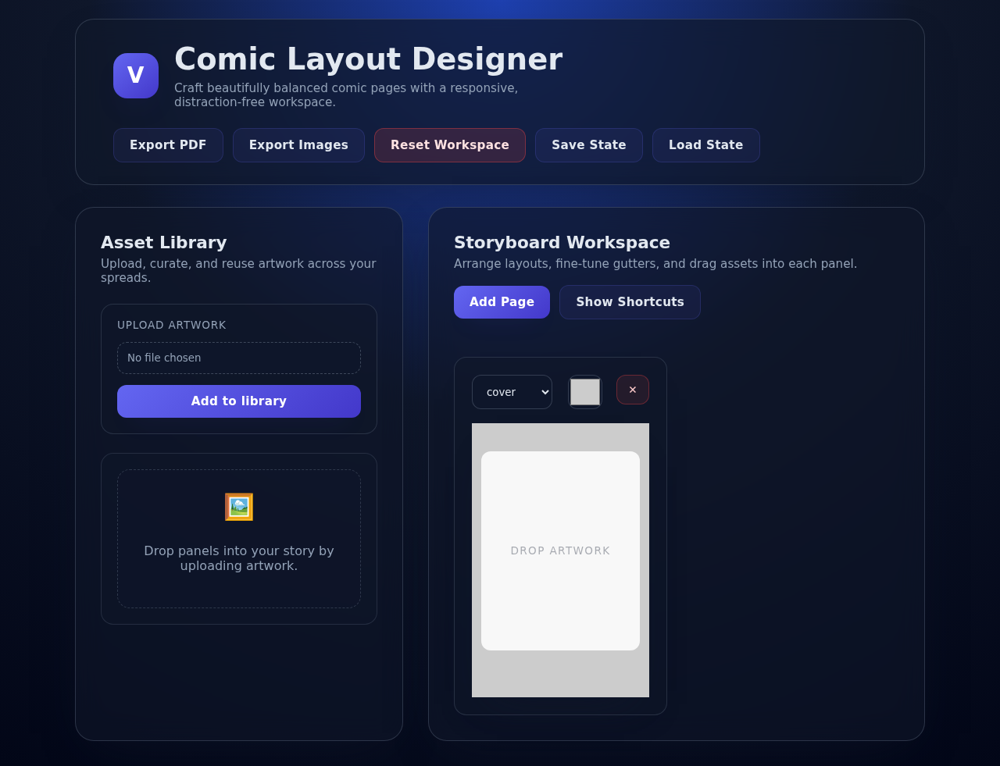
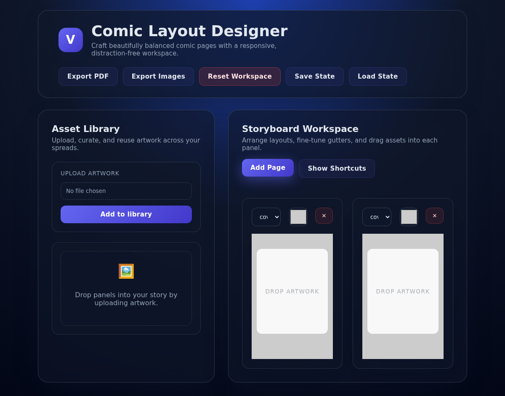
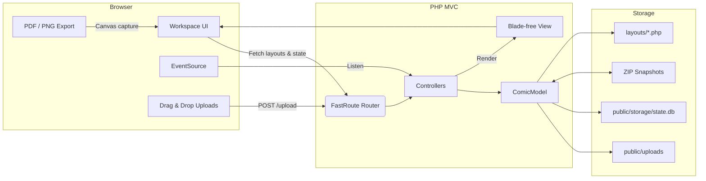

<h1 align="center">🎨 Comic Layout Designer</h1>
<p align="center">
  A glassmorphism-inspired PHP MVC application for arranging comic spreads, streaming live state updates, and exporting pristine PDFs or image sets.
</p>

<p align="center">
  <sub>Crafted with PHP 8 · FastRoute · Vanilla JavaScript · HTML Canvas · SQLite snapshots</sub>
</p>

---

## 🧭 Table of Contents
- [Screenshots](#-screenshots)
- [Why you'll love it](#-why-youll-love-it)
- [System architecture at a glance](#-system-architecture-at-a-glance)
- [Feature tour](#-feature-tour)
- [Project structure](#-project-structure)
- [Getting started](#-getting-started)
- [Daily workflow](#-daily-workflow)
- [Layout template catalog](#-layout-template-catalog)
- [State, sync, and persistence](#-state-sync-and-persistence)
- [Keyboard shortcuts](#-keyboard-shortcuts)
- [Testing and quality gates](#-testing-and-quality-gates)
- [Frontend architecture](#-frontend-architecture)
- [Troubleshooting](#-troubleshooting)
- [Contributing](#-contributing)
- [License](#-license)

---

## 🖼️ Screenshots
<p align="center">
  
  
</p>

These captures showcase the glassmorphism workspace, responsive asset library, and export tooling you will see after following the setup steps below.

---

## ✨ Why you'll love it
> [!TIP]
> Whether you're storyboarding a zine or shipping episodic comics, the workspace keeps your flow state front-and-center. Upload assets, drag them into responsive layouts, lock pages between revisions, and export in a single sitting.

- **Clarity-first UI** – A responsive two-column layout separates the asset library from the canvas, adapting from mobile to ultra-wide without ever clipping panels.
- **Live collaboration vibe** – Server-Sent Events keep every open tab in sync with the canonical `state.db` SQLite store, so collaborators instantly see page updates.
- **Export confidence** – One-click PDF and PNG exports mirror the in-browser transform math to avoid misaligned gutters or ghosted panels.
- **Snapshot safety** – Download or restore ZIP archives that bundle the SQLite state database alongside uploaded artwork for frictionless versioning.

---

## 🧱 System architecture at a glance

```mermaid
flowchart LR
    subgraph Browser
        UI[Workspace UI]
        SSE[EventSource]
        Uploads[Drag & Drop Uploads]
        Exports[PDF / PNG Export]
    end

    subgraph PHP MVC
        Router(FastRoute Router)
        Controllers
        Model[ComicModel]
        Views[Blade-free View]
    end

    subgraph Storage
        UploadDir[public/uploads]
        StateDb[public/storage/state.db]
        Snapshots[ZIP Snapshots]
        Layouts[layouts/*.php]
    end

    UI -->|Fetch layouts & state| Router --> Controllers --> Model
    SSE -->|Listen| Controllers
    Uploads -->|POST /upload| Router
    Controllers -->|Render| Views --> UI
    Model --> UploadDir
    Model --> StateDb
    Model <--> Snapshots
    Model --> Layouts
    Exports -->|Canvas capture| UI
```

---

## 🗺️ Feature tour
| Domain | Highlights |
| --- | --- |
| **Asset library** | Multi-file uploads with drag-and-drop, inline deletion, touch-friendly modal on small screens. |
| **Storyboard workspace** | Dynamic layout selector, gutter color picker, page locking (green **U**/**L** toggle), autosave banner, keyboard shortcut helper. Stored transforms are normalized to panel percentages so resizing the canvas never drifts artwork placements. |
| **Real-time sync** | Browser EventSource streams push notifications whenever the SQLite `state.db` changes on disk, so multiple sessions stay mirrored. |
| **State management** | Reset the world in one click, or save/load ZIP archives (`state.db` + uploads) to branch, share, or roll back progress. |
| **Exports** | Generate high-resolution PDFs or per-page PNGs. Exports are rendered at a canonical 900×1391 layout resolution so panel math stays consistent across viewports while preserving the 1:1.545 aspect ratio. |
| **Mobile experience** | A docked **Images** pill reveals the full-screen library, double-tap panels to place art without precision dragging. |

---

## 🗂️ Project structure
```
├── app
│   ├── Controllers       # HTTP endpoints (upload, state, streaming, pages)
│   ├── Core              # FastRoute bootstrap & lightweight database helper
│   ├── Models            # ComicModel orchestrates layouts, state, and storage
│   └── Views             # Server-rendered entry point (no templating engine)
├── layouts               # PHP + CSS pairs for every panel grid combination
├── public
│   ├── css / js          # Styled workspace shell and vanilla JS interactions
│   ├── index.php         # Front controller that boots the router
│   └── storage           # state.db and snapshot archives live here
├── tests                 # Lightweight smoke tests for models, layouts, and SSE helpers
├── composer.json         # Autoload + dependency metadata (PHP ≥ 8.0, FastRoute)
└── README.md             # You are here ✨
```

---

## 🚀 Getting started
### Prerequisites
- PHP **8.0+** with SQLite extension enabled
- Composer
- Modern browser (Chrome, Firefox, Safari, Edge)

### Install dependencies
```bash
composer install
```

### Serve the application
```bash
php -S localhost:8000 -t public
```

Then visit **http://localhost:8000** and start crafting spreads. Uploaded files land in `public/uploads/`, and exports download straight to your browser.

---

## 🔄 Daily workflow
1. **Upload assets** via drag-and-drop or the file picker. The library will show thumbnails instantly.
2. **Compose pages** by selecting a layout, dragging assets into panels, tweaking gutter colors, and zooming imagery with the scroll wheel.
3. **Lock spreads** once they look right using the **U/L** toggle to avoid accidental edits.
4. **Autosave** keeps progress persistent by streaming every change into `public/storage/state.db` and broadcasting updates via SSE.
5. **Snapshot** progress with **Save State** (download ZIP) or roll back with **Load State** (upload ZIP). Each archive bundles the SQLite database plus any referenced uploads.
6. **Export** to PDF or PNG when you're ready to share; the high-resolution canvas ensures print-ready fidelity without aspect ratio drift.

> [!IMPORTANT]
> Resetting the workspace clears both the SQLite state and any uploaded files. Use Save State before resetting if you want a restore point.

---

## 🧩 Layout template catalog
Every layout pairs a PHP template with a dedicated CSS grid definition. Templates pre-render server-side so the browser receives ready-to-style HTML without needing client-side templating.

Available templates include:
- `cover`
- `one-horizontal-top-two-vertical-bottom`
- `one-horizontal-top-three-vertical-bottom`
- `one-vertical-left-two-horizontal-right`
- `two-horizontal`
- `two-horizontal-left-one-vertical-right`
- `two-vertical-top-one-horizontal-bottom`
- `three-horizontal`
- `three-vertical`
- `four-grid`
- `wide-top-portrait-left-two-square-right` – Cinematic banner clamped around 16:9, a guttered portrait column, and stacked beats that size themselves to the remaining space.

Add your own by creating matching `.php` and `.css` files inside `layouts/`; `App\Models\ComicModel` will auto-discover and expose them to the UI.

---

## 🧠 State, sync, and persistence
- **Single source of truth** – `public/storage/state.db` mirrors the current layout, locked status, gutter settings, and image assignments.
- **Server-Sent Events** – `PageController::stream()` releases the PHP session lock before long-polling to ensure refreshes never stall behind an open stream.
- **Database imports** – Uploading a ZIP snapshot restores `state.db` and all referenced artwork, guaranteeing a perfect recreation of past sessions.
- **Filesystem hygiene** – Reset operations purge orphaned uploads to keep disk usage predictable.

---

## ⌨️ Keyboard shortcuts
| Shortcut | Action |
| --- | --- |
| `Ctrl` + `S` | Save the current project |
| `Ctrl` + `N` | Add a new page |
| `Ctrl` + `E` | Export as PDF |
| `Ctrl` + `I` | Export as PNG images |
| Mouse scroll | Zoom in/out on a placed image |

Need a refresher mid-session? Toggle **Show Shortcuts** in the workspace toolbar to reveal an animated cheatsheet.

---

## ✅ Testing and quality gates
The repository includes lightweight guardrail scripts that can be executed directly with PHP:

```bash
# Validate rendered layout templates
php tests/LayoutTemplateTest.php

# Confirm ComicModel generates HTML for every layout
php tests/ComicModelTemplateRenderingTest.php

# Exercise state reset + archive import helpers
php tests/StateManagementTest.php
php tests/ImportStateFromDatabaseTest.php

# Ensure session locks release before SSE streaming
php tests/SessionLockTest.php

# Security controls (CSRF, upload content inspection)
php tests/SecurityTest.php

# Health & readiness checks
php tests/HealthReadinessTest.php
```

### Node.js Development Tools
For development convenience, a Node.js test runner is available:

```bash
# Install Node.js dependencies
npm install

# Run PHP lint check + all PHP tests through Node.js test runner
npm test
# or
node run-tests.js
```

The Node.js test runner runs a recursive `php -l` syntax check over every `.php` file in the `app/` directory tree before executing the test suite, so broken PHP syntax is caught before any test runs.

All tests exit with status code `0` on success and emit a descriptive message on failure.

### Release automation
Manual Windows builds of the Electron shell can be produced directly from GitHub using the **Build Electron Release** workflow:

1. Navigate to **Actions → Build Electron Release**.
2. Trigger **Run workflow** on the `dev` branch and supply the semantic version (for example, `1.2.0`).
3. Wait for the workflow to finish building the installer, uploading the artifact, and publishing a draft release tagged with the provided version.

The workflow installs PHP and Node.js dependencies, runs the Electron packager via `npm run dist`, bundles a PHP runtime into `resources/php`, and attaches the generated installer to the GitHub release so QA can validate it before promotion.

---

## 🚢 Production deployment

### Server requirements

| Requirement | Notes |
| --- | --- |
| **PHP 8.0+** | Extensions: `pdo`, `pdo_sqlite`, `zip`, `fileinfo` |
| **Writable storage** | `public/uploads/` and `public/storage/` must be writable by the web server process |
| **Web server** | Apache with `mod_rewrite` (`.htaccess`) or Nginx with `try_files` rewrites pointing to `public/index.php` |

### Environment configuration

The application reads no `.env` file and has no required environment variables. All paths are derived relative to the project root at runtime. Database and upload paths can be overridden by editing `app/Core/Database.php` and `app/Models/ComicModel.php` if a custom data directory is needed.

### Permissions

```bash
# Ensure the web server user owns or can write to storage directories
chown -R www-data:www-data public/uploads public/storage
chmod -R 775 public/uploads public/storage
```

### Health probes

Two lightweight endpoints are available for load-balancer and orchestrator probes:

| Endpoint | Purpose |
| --- | --- |
| `GET /health` | Liveness – returns `{"status":"ok"}` with HTTP 200 as long as PHP is alive |
| `GET /ready` | Readiness – checks database accessibility and upload directory writability; returns HTTP 503 if either check fails |

### Backup and restore

Export the current state at any time through the UI **Save State** button or by archiving `public/storage/state.db` and `public/uploads/` together.

To restore, use the **Load State** button and supply a previously exported ZIP. For disaster recovery, replace `state.db` and the `uploads/` directory directly on the filesystem and restart the PHP process.

### Incident runbook

| Symptom | Action |
| --- | --- |
| Uploads fail | Verify `public/uploads/` is writable and `php.ini` `upload_max_filesize` and `post_max_size` are at least 5 MB |
| State import fails | Re-export a clean archive via the UI; check that the ZIP contains both `state.db` and the `uploads/` directory |
| `/ready` returns 503 | Inspect the `checks` key in the JSON response for which sub-check failed, then fix permissions or recreate the database |
| SSE stream disconnects | Ensure the reverse proxy does not buffer the response (`X-Accel-Buffering: no` is already emitted); increase proxy timeout to ≥ 35 s |

### Release checklist

Before tagging a production release, confirm the following:

- [ ] All tests pass: `npm test`
- [ ] PHP lint passes (included in `npm test`)
- [ ] `GET /health` returns `{"status":"ok"}`
- [ ] `GET /ready` returns `{"status":"ready","checks":{"database":"ok","uploads":"ok"}}`
- [ ] Manual smoke test: upload an image, arrange a page, save, export PDF
- [ ] State export and import round-trip produces the same page layout
- [ ] Rollback plan: backup of `state.db` and `uploads/` is available before deployment

---

## 🧱 Frontend architecture

The browser code is organized as ES modules so individual concerns can evolve without navigating a 1,700-line script:

- `public/js/image-library.js` handles the asset gallery, uploads, and selection state.
- `public/js/pages.js` owns layout rendering, persistence, state streaming, and shared constants.
- `public/js/exporters.js` focuses on PDF/PNG export routines and keyboard shortcuts.
- `public/js/save-indicator.js` and `public/js/state.js` keep UI feedback and shared flags centralized.
- `public/js/csrf.js` exposes `getCsrfHeaders()` which reads the `<meta name="csrf-token">` tag and returns the header object used on every mutating `fetch()` call.
- `public/js/app.js` wires the modules together on `DOMContentLoaded`.

When contributing frontend features, choose the module that matches the responsibility above or create a new one for any major concern rather than expanding `app.js` again.

---

## 💬 Chat Bubbles

Each panel inside a page can hold any number of **speech bubbles** — overlays for dialogue, captions, and thought balloons.

### Adding and editing a bubble
1. Hover over a panel to reveal the **+ Bubble** button at the bottom of the panel.
2. Click **+ Bubble** to insert a new speech bubble.
3. Click the bubble text to edit it in place (the `bubble-text` element is `contenteditable`).
4. Drag the bubble by its body to reposition it.
5. Drag the resize handle (bottom-right corner) to change its dimensions.
6. Click **◉** (top-left) to cycle through styles: *speech → thought → narration*.
7. Click **✕** (top-right) to delete the bubble.

> All interactions are blocked when a page is **locked**.

### Bubble styles
| Style | Appearance |
| --- | --- |
| `speech` | White rounded rect, solid border |
| `thought` | Rounded rect, dashed border |
| `narration` | Square cornered, yellow-tinted background |

### State schema

Bubble data lives inside the `bubbles` field of each persisted page object. The shape is:

```json
{
  "layout": "two-horizontal",
  "gutterColor": "#cccccc",
  "slots": {},
  "transforms": {},
  "locked": false,
  "bubbles": {
    "1": [
      {
        "id": "bubble-1700000000000-1",
        "text": "Hello!",
        "xPct": 5,
        "yPct": 5,
        "widthPct": 45,
        "heightPct": 22,
        "tail": "none",
        "style": "speech",
        "zIndex": 10
      }
    ]
  }
}
```

Keys in `bubbles` correspond to panel slot numbers (same keys used by `slots` and `transforms`). Each slot holds an ordered array of bubble objects. The ordering is stable across save/load cycles. All `*Pct` fields are expressed as percentages of the panel's dimensions, ensuring bubbles remain correctly positioned across responsive layout changes.

### Export

When you export a page to PNG/PDF via **renderLayoutToCanvas()**, bubbles are drawn after the panel image using the same panel clip region. Text is wrapped to fit the bubble width, and the style (speech/thought/narration) is reflected in fill colour and border style. Stacking order follows `zIndex`.

---

## 🛠️ Troubleshooting
| Symptom | Fix |
| --- | --- |
| **Uploads fail silently** | Confirm `public/uploads/` is writable by your PHP process. |
| **Event stream never resolves** | Ensure your PHP installation supports `stream_select` and that `PageController::stream()` is reachable over HTTP/1.1. |
| **Exports look misaligned** | Clear the workspace state, then verify each layout CSS file still includes matching `.panel` and `.panel-inner` wrappers. |
| **Importing a snapshot throws an error** | The ZIP must include both `state.db` and the `uploads/` directory. Run `php tests/ImportStateFromDatabaseTest.php` locally to sanity-check the importer. |

---

## 🤝 Contributing
1. Fork the repository and create a feature branch.
2. Run the PHP smoke tests before opening a pull request.
3. Attach screenshots or GIFs for UI changes to highlight the updated experience.
4. Keep documentation (including this README) in sync with new features or workflows.

---

## 📄 License
Licensed under the [MIT License](LICENSE). Create, remix, and publish your stories with confidence.

---

<p align="center"><sub>“Great layouts are invisible—your story is the star.”</sub></p>
